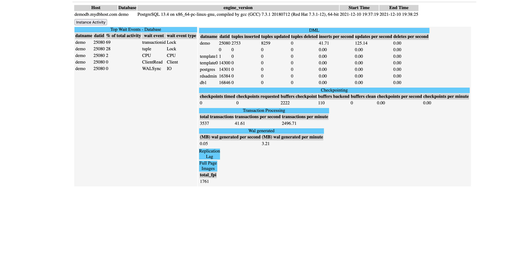

# pg-stats
Simple PostgreSQL performance snapshots capturing and reporting

## How to build

1. Install GoLang follwoing the official Docs https://go.dev/doc/install
2. Build the binary using the following command. Refer to Golang docs to build forvarious platforms.
```
go build .
```

## Usage

### Prerequisites

Checkout the help menu. Notice that many of the options will resemble standard psql tools
```
mymachine pg-stats % ./pgstats -help
pg_stats usage menu
-------------------
-h, --host=HOSTNAME 	 database server host or socket directory
-d, --dbname=DBNAME      database name to connect to
-p, --port=portIn	 database server port ( default 5432 )
-U, --username=USERNAME  database user name
-w, --no-password        never prompt for password
-W, --password           force password prompt (should happen automatically)
-o, --output=OUTPUT      output directory of the samples ( default /tmp )
-t, --timeout=TIMEOUT    sampling timeout ( default 60 )
-a, --action=ACTION      action to perform: all, report, collect ( default 'all' )
-f, --file=OUTPUT_FILE   file path ( default /tmp/out.html )
-s, --start=START        time of first snapshot to report when --action/a = report ( format = YYYY-MM-DD HH:MI:SS )
-e, --end=END            time of last snapshot to report when --action/a = report ( format = YYYY-MM-DD HH:MI:SS )
--hammer		 		 For use with HammerDB. To gather HammerDB order stats
```

Second, install [pg_stat_statements](https://www.postgresql.org/docs/current/pgstatstatements.html) on the target database

```
CREATE EXTENSION pg_stat_statements;
```

### Running a snaphot and generating a report
### The report output is /tmp/out.html and the Snapshot directory is /tmp/demodb.mydbhost.com

```
export PGHOST=demodb.mydbhost.com
export PGDATABASE=demo
export PGUSER=demo
export PGPASSWORD=demo
./pgstats -o /tmp/demodb.mydbhost.com

2021/12/10 19:37:16 Snapshot Output Directory: /tmp/demodb.mydbhost.com
2021/12/10 19:37:16 Report Output File: /tmp/out.html
2021/12/10 19:37:16 Endpoint: demodb.mydbhost.com Database: demo Port: 5432 Timeout: 60
2021/12/10 19:37:16 Running stats a total of 7 time every 10 seconds
2021/12/10 19:37:16 Running activity a total of 60 time every 1 seconds
2021/12/10 19:37:17 Successfully connected!
2021/12/10 19:37:17 Successfully connected!
2021/12/10 19:37:17 start running query for lsn_start
2021/12/10 19:37:17 done running query for lsn_start
2021/12/10 19:37:17 Starting Stats in thread = 2. 7 samples. Sleeping for 10 between samples.
2021/12/10 19:37:17 Starting Activity in thread = 1. 60 samples. Sleeping for 1 seconds between samples.
2021/12/10 19:37:19 thread = 1 completed 1 samples
2021/12/10 19:37:29 thread = 2 completed 1 samples
2021/12/10 19:38:00 thread = 1 completed 30 samples
2021/12/10 19:38:36 Done Capturing Samples for thread 2
2021/12/10 19:38:36 Stats Collection Done. Thread = 2
2021/12/10 19:38:43 thread = 1 completed 60 samples
2021/12/10 19:38:43 Done Capturing Samples for thread 1
2021/12/10 19:38:43 Activity Collection Done. Thread = 1
2021/12/10 19:38:43 start loading pg_version
2021/12/10 19:38:43 done loading pg_version
2021/12/10 19:38:43 start running query for pg_version
2021/12/10 19:38:43 done running query for pg_version
2021/12/10 19:38:43 start loading pg_stat_database
2021/12/10 19:38:43 done loading pg_stat_database
2021/12/10 19:38:43 start running query for pg_stat_database
2021/12/10 19:38:43 done running query for pg_stat_database
2021/12/10 19:38:43 start running query for pg_stat_database
2021/12/10 19:38:43 done running query for pg_stat_database
2021/12/10 19:38:43 start running query for pg_stat_database
2021/12/10 19:38:43 done running query for pg_stat_database
2021/12/10 19:38:43 dropped table pg_stat_database
2021/12/10 19:38:43 start loading pg_stat_bgwriter
2021/12/10 19:38:43 done loading pg_stat_bgwriter
2021/12/10 19:38:43 start running query for pg_stat_bgwriter
2021/12/10 19:38:43 done running query for pg_stat_bgwriter
2021/12/10 19:38:43 dropped table pg_stat_bgwriter
2021/12/10 19:38:43 start loading pg_stat_activity
2021/12/10 19:38:44 done loading pg_stat_activity
2021/12/10 19:38:44 start running query for pg_stat_activity
2021/12/10 19:38:44 done running query for pg_stat_activity
2021/12/10 19:38:44 start running query for pg_stat_activity
2021/12/10 19:38:44 done running query for pg_stat_activity
2021/12/10 19:38:44 start running query for pg_stat_activity
2021/12/10 19:38:44 done running query for pg_stat_activity
2021/12/10 19:38:44 dropped table pg_stat_activity
2021/12/10 19:38:44 Could not query metric in temporary database pg_stat_replication: no such table: pg_stat_replication
2021/12/10 19:38:44 Could not drop temporary table : no such table: pg_stat_replication
2021/12/10 19:38:44 dropped table pg_stat_replication
2021/12/10 19:38:44 start loading pg_stat_statements
2021/12/10 19:38:44 done loading pg_stat_statements
2021/12/10 19:38:44 start running query for pg_stat_statements
2021/12/10 19:38:44 done running query for pg_stat_statements
2021/12/10 19:38:44 dropped table pg_stat_statements
```

The output wil be in a easy to read HTML



### Top Clean up snapshot data

Simply `rm` the directory. i.e `rm /tmp/demodb.mydbhost.com`

### Contributions and further development

The tool is still in active development and ideas are welcome. 

Some of the items on the to-do list are :

1. Adding more sections to the report. Currently all the pg_stat_* views are captured but are not reported.
	- Add per table Vacuum stats
	- Add per table I/O stats
	- Add per table DML stats
3. Support storing output to cloud storage such as AWS S3.

